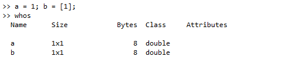
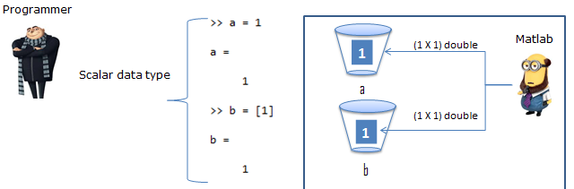
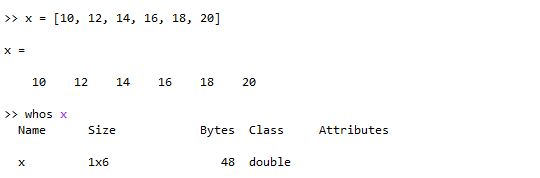
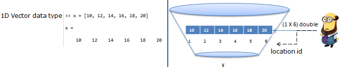
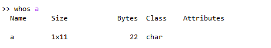
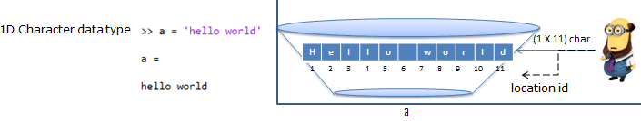
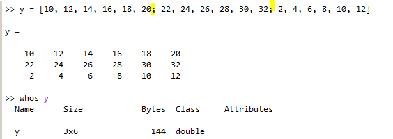
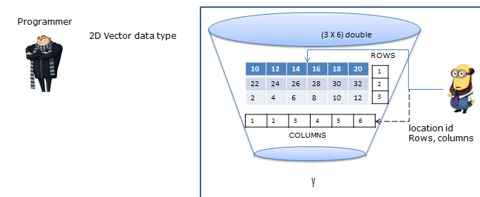

### 1. Matlab variables

Matlab uses variables to store its contents in computer memory. A variable has two parts,`<variable name> = <the value it should hold>`.

#### 1.1 Scalar variable
Example ``` a = 1; b = [1]; ```




Matlab engine interprets data type, size and allocates cup (memory) for given variables & stores the content ( = 1) inside the cup.

#### 1.2 1D vector



Matlab allocates six columns with data type as __double__ in location `1, 2, 3, 4, 5, 6` and stores the content `10, 12, 14, 16, 18, 20` in the corresponding location



Simillarly in case of character data type matlab memory allocation will look like below




#### 1.3 2D vector

Simillar to 1d vector if the numbers are delmited by `,` it creates a new column for the next guy. If it is delimited by `;` (see the highlighted parts in below image) then it introduces new row after that.




    Summary:
    - Matlab handles every variable as matrix (vector).
    - It allocates memory and binds it with variable name
    - Inserts the content in the corresponding memory location

#### 1.4 Indexing

`variable_name(<rows>, <columns>) `

Example:

- Inorder to get the element of __1st row__ and __6th column__ ` y(1, 6)`
- To specify __all rows (or) columns__ use key word` : `
	- ` y(:, 1) ` returns all the elements present in first column
	- ` y(2, :) ` returns all the elements present in second row
- To specify __last row (or) column__ use key word` end `
	- ` y(:, end) ` returns all the elements present in 6th column
	- ` y(end, :) ` returns all the elements present in 3rd row

---

